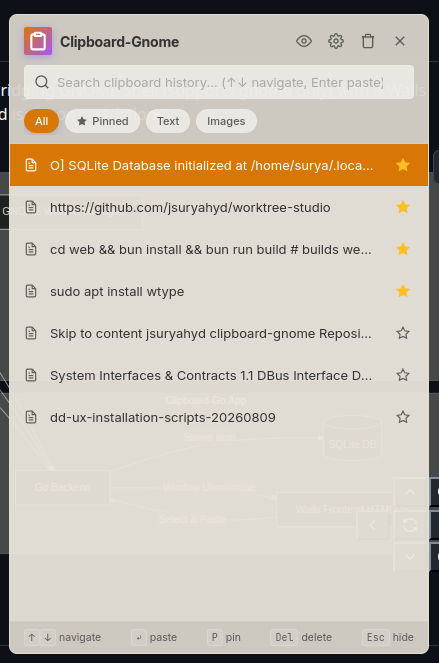
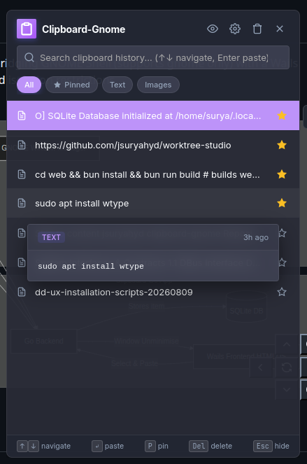
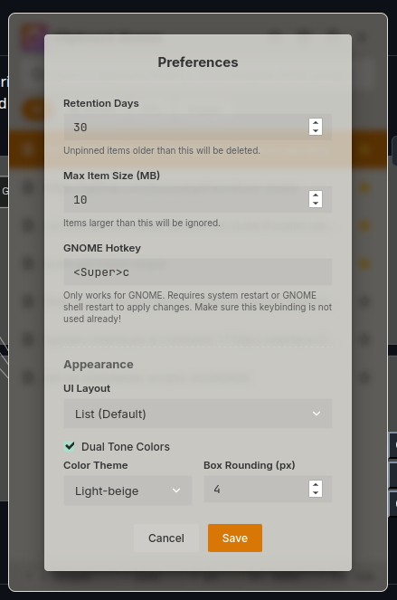
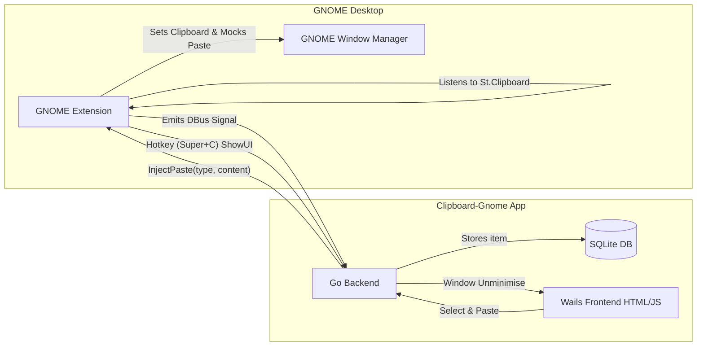

# Clipboard-Gnome

Clipboard-Gnome is a fast, hybrid Wayland/X11 clipboard manager built with Go and Wails.

## Screenshots




## Architecture

Clipboard-Gnome utilizes a hybrid architecture bridging GNOME Shell (supports gnome only) with a Wails application via DBus to bypass Wayland clipboard isolation restrictions.



## Installation

An installation script is provided in the repository to build and install the necessary components automatically.

### Dependencies
Ensure the following tools are installed on your system before proceeding: `go`, `npm`, `sqlite3`, `zip`, `unzip`, `curl`.

### Steps
1. Clone this repository and navigate to the root directory.
2. Run the installation script:
   ```bash
   ./install.sh
   ```
   The script will:
   - Build the Wails binary (`make build`)
   - Package and install the GNOME Extension (`make install`)
   - Copy the binary to `~/.local/bin/clipboard-gnome`

3. **Restart GNOME Shell**: 
   - Press `Alt+F2`, type `r`, and hit Enter (X11 only) or logout and log back in (Wayland).
4. **Enable the Extension**: Open the *Extensions* app or use the GNOME Extensions website to enable the `clipboard-gnome@surya.dev` extension.
5. **Auto-Start**: On its first run, `clipboard-gnome` will automatically add an autostart entry (`~/.config/autostart/clipboard-gnome.desktop`) so it runs seamlessly in the background on subsequent boots.

## TODOs
1. **Images not saved**: Currently, images copied to the clipboard are not displaying in the UI. GNOME shell's `St.Clipboard.get_text()` does not read image data. The extension logic needs to be updated to handle mimetypes like `image/png` properly.
2. **Code quality improvements**: See [docs/code-quality-todo.md](./docs/code-quality-todo.md) for a list of incoming refactors and improvements.
3. **Reference implementations**: We can learn practical issues and potential edge cases from existing clipboard libraries like the `copyous` project.

## Unlicensed
This project was built with AI and is unlicensed. You are free to use, modify, and distribute it as you want.
